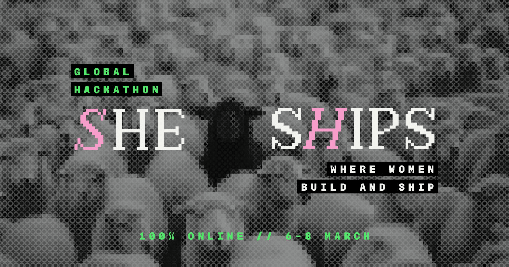

<h1 align="center">
  She Ships
  <br />
</h1>

<p align="center">
  Donde las mujeres construyen y hacen ship
  <br />
  <br />
  <a href="https://she-ships.crafter.run">Website</a>
  ·
  <a href="https://github.com/crafter-station/she.ships/issues">Issues</a>
</p>

<p align="center">
  <a href="https://nextjs.org">
    
  </a>
  <a href="https://clerk.com">
    
  </a>
  <a href="https://tailwindcss.com">
    
  </a>
  <a href="https://www.typescriptlang.org">
    
  </a>
</p>

<p align="center">
  <sub>
    by
    <a href="https://www.crafterstation.com">
       Crafter Station
    </a>
  </sub>
</p>

## About

She Ships es un evento global online el **8 de marzo, 2026** para mujeres que quieren convertir ideas en productos reales. Sin codigo, sin barreras, solo builders haciendo ship.

## Get Started

```bash
git clone https://github.com/crafter-station/she.ships.git
cd she.ships
bun install
bun run dev
```

## Stack

- **Next.js 16** + App Router
- **Tailwind CSS 4** + shadcn/ui
- **Clerk** (Waitlist + Spanish locale)
- **COBE** (Interactive globe)
- **Motion** (Animations)

## License

MIT
